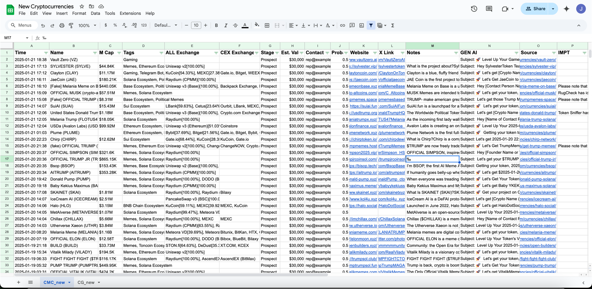

# Cryptocurrency Listing Scraper

## Project Overview
An automated web scraping tool that monitors and collects data about newly listed cryptocurrencies from CoinMarketCap (CMC) and CoinGecko (CG). The tool extracts detailed information about each listing and maintains the data in Google Sheets.<br>


## Key Features
- Real-time monitoring of new cryptocurrency listings
- Data extraction from multiple sources (CMC and CG)
- Automatic Google Sheets updating
- Comprehensive data collection including:
  - Coin name and symbol
  - Market capitalization
  - Exchange listings (CEX/DEX)
  - Social media presence
  - Project description
  - Website information
  - Trading pairs and volumes

## Technical Requirements
- Python 3.7+
- Chrome WebDriver
- Google Cloud Platform account
- Required Python packages:
  ```
  beautifulsoup4
  selenium
  google-auth
  google-generativeai
  gspread
  requests
  ```

## Installation
1. Clone the repository:
```bash
git clone https://github.com/Joshua-Leow/scrape_CMC.git
cd scrape_CMC
```

2. Install dependencies:
```bash
pip install -r requirements.txt
```

3. Set up Google Cloud Platform:
   - Create a new project
   - Enable Google Sheets API
   - Create service account credentials
   - Download JSON credentials file
   - Rename to `credentials.json` and place in project root

4. Configure Chrome WebDriver:
   - Download ChromeDriver matching your Chrome version
   - Update path in `config.py`

5. Configure settings in `config.py`:
   - Set API endpoints
   - Adjust scraping parameters
   - Set maximum rows limit

## Project Structure
```
├── main.py                     # Main execution script
├── config.py                   # Configuration settings
├── google_sheets.py            # Google Sheets integration
├── genai.py                    # Generation AI integration
├── scraper/
│   ├── scraper_cmc.py          # CoinMarketCap scraper
│   ├── scraper_cg.py           # CoinGecko scraper
│   ├── pages_cmc.py            # Page selectors in CoinMarketCap
│   └── pages_cg.py             # Page selectors in CoinGecko
├── data/                       # Data storage
│   ├── CG_table.txt            # Copy paste HTML table from CoinGecko
│   ├── last_hyperlink_cg.txt   # last hyperlink extracted from CoinGecko
│   └── last_hyperlink_cmc.txt  # last hyperlink extracted from CoinMarketCap
└── credentials.json            # Google API credentials
```

## Usage
1. Run the scraper:
```bash
python main.py
```

2. Monitor output:
- Terminal will show scraping progress
- Google Sheets will update automatically
- Check logs for any errors

## Data Collection
The scraper collects the following information:
- Listing timestamp
- Coin name and symbol
- Market capitalization
- Exchange listings
- Trading pairs
- Social media links
- Project description
- Website URL
- Tags/categories
- Trading volume
- Price information

## Error Handling
The system includes comprehensive error handling for:
- Network failures
- Rate limiting
- Missing data
- Authentication issues
- Parsing errors
- API timeouts

## Maintenance
Regular maintenance tasks:
1. Update ChromeDriver when Chrome updates
2. Check for site structure changes
3. Monitor Google API quotas
4. Update selectors if websites change
5. Verify credentials haven't expired

## Best Practices
- Don't exceed rate limits
- Regularly backup data
- Monitor error logs
- Update dependencies
- Keep credentials secure

## Contributing
1. Fork the repository
2. Create feature branch
3. Commit changes
4. Push to branch
5. Create Pull Request

## License
MIT License

## Support
For issues and questions, please create an issue in the GitHub repository.